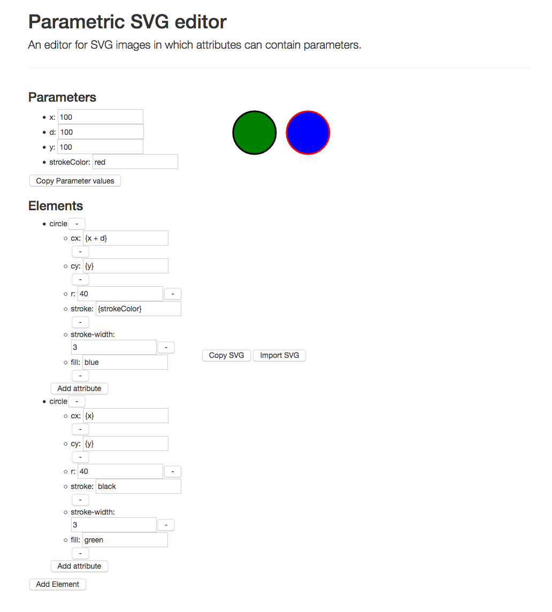

# Parametric SVG Editor

The editor is accessible online [here](https://jamesscottbrown.github.io/parametric-svg-editor/).

This is an editor for SVG images that can contain parameters.

It allows you to add, edit or delete elements of an SVG and their attributes.

The value assigned to a particular attribute can be a concrete value (e.g. ``red`` or ``20.5``), or be an expression including one or more parameters enclosed in double curly brackets (e.g. ``{strokeColor}`` or ``{radius * 2}``).
The parameter can be a number or a string; however, it it is a string then it cannot be used in an arithmetic expression (if ``strokeColor`` is ``red``, then it is fine for an attribute to have the value ``{strokeColor}``, but not something like ``{strokeColor * 2}``).

If an attributes value is set to be a parametric expression, fields correpsonding to any parameters that were not previously used are automatically added to the parameter list.

The arithmetic operations supported are those supported by [math.js](http://mathjs.org).
This project also uses [d3.js](https://d3js.org/).
